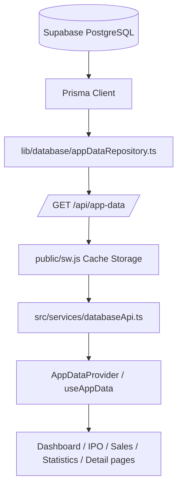

# HKIPO Dashboard Data Flow

审计日期：2026-07-15
范围：运行时代码、API、Prisma/PostgreSQL、浏览器存储、恢复 JSON、PWA 缓存。
本文件只描述现状，不代表推荐架构。

## 1. 当前主数据流



核心业务数据的运行时主来源是 PostgreSQL，不是 `localStorage`。审计时发现 Service Worker 会对普通 GET 请求执行缓存优先策略；该风险现已修复，`/api/*` 使用 Network Only 且不会写入 Cache Storage。

## 2. 全部数据入口

| 数据入口 | 文件与函数 | 当前用途 | 是否为核心页面主来源 |
| --- | --- | --- | --- |
| PostgreSQL / Prisma | `lib/database/appDataRepository.ts:getAppDataSnapshot()` | 查询 Account、Ipo、AccountIpo、SellRecord、Withdrawal、ExchangeRecord | 是 |
| 聚合 API | `api/app-data.ts:handler()` | 返回 `{ ok, data }`，设置 `Cache-Control: no-store` | 是 |
| 前端 API 客户端 | `src/services/databaseApi.ts:loadDatabaseAppData()` | 请求 `/api/app-data`；封装业务 CRUD API | 是 |
| React 全局状态 | `src/hooks/useAppData.tsx:AppDataProvider()` | 首次挂载和写入后重新请求数据库快照 | 是，页面内存态 |
| 账户专用 API | `src/features/accounts/AccountsPage.tsx:loadAccounts()` | 直接请求 `/api/accounts` 和 `/api/broker-profiles` | 仅账户管理页 |
| Data Center API | `src/features/dataCenter/DataCenterPage.tsx` | 请求 `/api/data-center`、`/api/sync` | 仅数据中心 |
| Planner API | `src/features/planner/CapitalAllocationPage.tsx` | 请求 `/api/planner`、`/api/planner/generate` | 仅 Planner |
| PWA Cache Storage | `public/sw.js:fetch` handler | 非导航、非脚本/样式的 GET 使用 cache-first | 是，可能拦截 API |
| localStorage UI 状态 | `usePersistentState`、`useThreeStateSort`、`privacy.ts` | 时间/排序/隐私等 UI 设置 | 否 |
| localStorage 旧业务快照 | `src/services/storage.ts:loadAppData/saveAppData` | v1/v2/v3 数据和备份迁移代码 | 否，当前启动链无调用者 |
| localStorage 维护 | `src/services/storageMaintenance.ts` | 统计占用、清理旧备份和日志 | 否 |
| 内存审计快照 | `src/services/audit.ts` | 操作日志、版本快照、每日备份，仅当前页面生命周期 | 否 |
| JSON 恢复文件 | `HKIPO_LATEST_RECOVERY_IMPORT.json`、`recovery/*.json` | 一次性导入 PostgreSQL 的历史源 | 迁移源，不是运行时源 |
| `public.user_data` | 旧迁移 SQL、`scripts/*cloud*.mjs` | 旧 Supabase JSON 云同步诊断/手工脚本 | 否 |
| IndexedDB | 无匹配代码 | 未使用 | 否 |

## 3. grep 审计结果

### `localStorage`

- `src/hooks/usePersistentState.ts`: `usePersistentState()` 读取和保存轻量 UI 状态。
- `src/hooks/useThreeStateSort.ts`: `useThreeStateSort()` 保存表格排序。
- `src/services/privacy.ts`: `loadPrivacySettings()`、`savePrivacySettings()`。
- `src/services/storage.ts`: `readJson()`、`loadAppData()`、`saveAppData()` 保存完整旧业务快照。
- `src/services/storageMaintenance.ts`: `getStorageUsage()`、`cleanupOldBackups()`、`clearOperationLogs()`、`safeSetLocalStorageItem()`。
- `scripts/diagnose-cloud-sync.mjs`、`check-user-data-db-layer.mjs`、`force-upload-local-data-to-cloud.mjs`、`trace-huajian-sync.mjs`: 从 Chrome LevelDB 读取旧 localStorage，仅手工诊断。

### `indexedDB`

源代码中无匹配项。项目没有 IndexedDB 业务数据入口。

### `getAppDataSnapshot`

- `api/app-data.ts`：核心全量读取。
- `api/account-ipos.ts`、`api/ipos.ts`：部分操作完成后返回新快照。
- `lib/database/appDataRepository.ts`：唯一实现，直接查询 Prisma。

### `user_data`

- `prisma/schema.prisma` 和迁移中仍保留 `UserData` 表。
- 运行时 React/API 不读取该表。
- 仅旧同步诊断脚本直接访问 `public.user_data`。

### `supabase`

- 运行时没有 Supabase JS Client。
- 数据库通过 Prisma 的 `DATABASE_URL` 连接 Supabase PostgreSQL。
- `src/types/cloud.ts` 只保留旧 UI 类型名。
- 硬编码 Supabase REST URL 只存在于手工诊断脚本。

### `fetch('/api')` / API 请求

- `AccountsPage`: `/api/accounts`、`/api/broker-profiles`。
- `DataCenterPage`: `/api/data-center`、`/api/sync`。
- `CapitalAllocationPage`: `/api/planner`、`/api/planner/generate`。
- `databaseApi.ts` 间接请求：`/api/app-data`、accounts、ipos、account-ipos、sell-records、withdrawals、exchange-records。

## 4. 启动调用链

```text
src/main.tsx
  -> AppDataProvider
  -> initial state = normalizeAppData({})
  -> useEffect(refreshData)
  -> loadDatabaseAppData()
  -> GET /api/app-data
  -> getAppDataSnapshot()
  -> Prisma
  -> PostgreSQL
  -> normalizeAppData(response.data)
  -> setData()
  -> React pages rerender
```

启动时没有调用 `loadAppData()`，所以 localStorage 中存在 `hkipo-dashboard:data:v3` 并不会覆盖数据库。

生产环境额外注册 `public/sw.js`。该 Service Worker 对 `/api/app-data` 没有例外规则，API GET 会进入通用 cache-first 分支。

## 5. 页面调用链

### Dashboard

```text
DashboardPage
  -> useAppData()
  -> AppDataProvider
  -> loadDatabaseAppData()
  -> GET /api/app-data
  -> getAppDataSnapshot()
  -> Prisma/PostgreSQL
```

Dashboard 不调用现有的 `/api/dashboard`，统计由 `DashboardPage.tsx` 和 `src/utils/statistics.ts` 在浏览器中计算。

### 新股资料

```text
IposPage
  -> useAppData().ipos/subscriptions/sales
  -> GET /api/app-data
  -> Prisma Ipo/AccountIpo/SellRecord
```

默认搜索为空、行业为全部，因此输入数组数量等于数据库 Ipo 数量。

### 账户管理

```text
AccountsPage
  -> loadAccounts()
  -> GET /api/accounts
  -> accountRepository
  -> Prisma/PostgreSQL
```

该页面绕过 `AppDataProvider`，与账户详情页使用的 `/api/app-data` 是两条前端数据链。

### 卖出记录

```text
SalesPage
  -> useAppData().sales/subscriptions/accounts/ipos
  -> GET /api/app-data
  -> Prisma SellRecord/AccountIpo/Account/Ipo
```

默认搜索为空、申购筛选为全部，因此输入数组数量等于数据库 SellRecord 数量。

## 6. 写入调用链

```text
Page action
  -> useAppData CRUD method
  -> databaseApi.ts
  -> POST/PUT/DELETE /api/{resource}
  -> appDataRepository / repository
  -> Prisma/PostgreSQL
  -> refreshData()
  -> GET /api/app-data
  -> setData()
```

例外：`holdings` 和 `fxRates` 目前只修改 React 内存；`getAppDataSnapshot()` 固定返回空持仓和零汇率。`replaceData()` 也只替换 React 内存，没有写入数据库，刷新后会恢复为数据库数据。

## 7. 当前数据量对照

审计时直接查询 PostgreSQL：

| 实体 | 数据库 | 页面默认输入数组 | 差异 |
| --- | ---: | ---: | ---: |
| Account | 12 | 账户管理 12 | 0 |
| Ipo | 112 | 新股资料 112 | 0 |
| AccountIpo | 163 | Dashboard/申购上下文 163 | 0 |
| SellRecord | 24 | 卖出记录 24 | 0 |

浏览器最终看到的数量仍可能受搜索、账户筛选、时间筛选以及 Service Worker 旧缓存影响。
