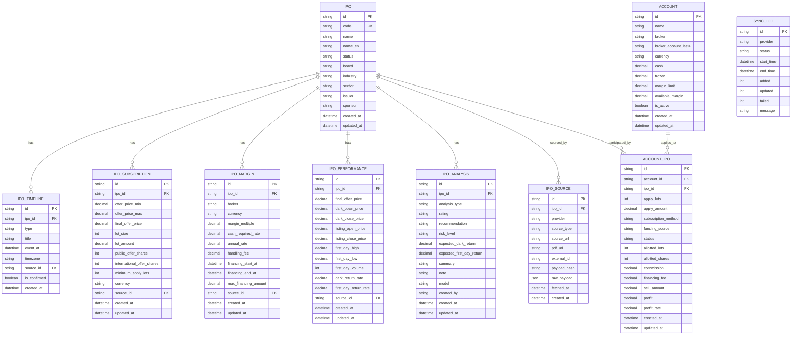
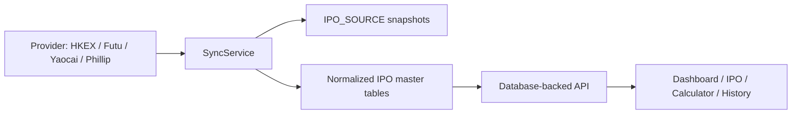
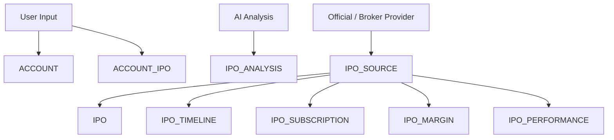

# IPO Master Database ER Diagram

Status: proposal for Sprint 4.

```mermaid
erDiagram
  IPO ||--o{ IPO_TIMELINE : has
  IPO ||--o{ IPO_SUBSCRIPTION : has
  IPO ||--o{ IPO_MARGIN : has
  IPO ||--o{ IPO_PERFORMANCE : has
  IPO ||--o{ IPO_ANALYSIS : has
  IPO ||--o{ IPO_SOURCE : sourced_by
  IPO ||--o{ ACCOUNT_IPO : participated_by
  ACCOUNT ||--o{ ACCOUNT_IPO : applies_to

  IPO {
    string id PK
    string code UK
    string name
    string name_en
    string status
    string board
    string industry
    string sector
    string issuer
    string sponsor
    datetime created_at
    datetime updated_at
  }

  IPO_TIMELINE {
    string id PK
    string ipo_id FK
    string type
    string title
    datetime event_at
    string timezone
    string source_id FK
    boolean is_confirmed
    datetime created_at
  }

  IPO_SUBSCRIPTION {
    string id PK
    string ipo_id FK
    decimal offer_price_min
    decimal offer_price_max
    decimal final_offer_price
    int lot_size
    decimal lot_amount
    int public_offer_shares
    int international_offer_shares
    int minimum_apply_lots
    string currency
    string source_id FK
    datetime created_at
    datetime updated_at
  }

  IPO_MARGIN {
    string id PK
    string ipo_id FK
    string broker
    string currency
    decimal margin_multiple
    decimal cash_required_rate
    decimal annual_rate
    decimal handling_fee
    datetime financing_start_at
    datetime financing_end_at
    decimal max_financing_amount
    string source_id FK
    datetime created_at
    datetime updated_at
  }

  IPO_PERFORMANCE {
    string id PK
    string ipo_id FK
    decimal final_offer_price
    decimal dark_open_price
    decimal dark_close_price
    decimal listing_open_price
    decimal listing_close_price
    decimal first_day_high
    decimal first_day_low
    int first_day_volume
    decimal dark_return_rate
    decimal first_day_return_rate
    string source_id FK
    datetime created_at
    datetime updated_at
  }

  IPO_ANALYSIS {
    string id PK
    string ipo_id FK
    string analysis_type
    string rating
    string recommendation
    string risk_level
    decimal expected_dark_return
    decimal expected_first_day_return
    string summary
    string note
    string model
    string created_by
    datetime created_at
    datetime updated_at
  }

  IPO_SOURCE {
    string id PK
    string ipo_id FK
    string provider
    string source_type
    string source_url
    string pdf_url
    string external_id
    string payload_hash
    json raw_payload
    datetime fetched_at
    datetime created_at
  }

  ACCOUNT {
    string id PK
    string name
    string broker
    string broker_account_last4
    string currency
    decimal cash
    decimal frozen
    decimal margin_limit
    decimal available_margin
    boolean is_active
    datetime created_at
    datetime updated_at
  }

  ACCOUNT_IPO {
    string id PK
    string account_id FK
    string ipo_id FK
    int apply_lots
    decimal apply_amount
    string subscription_method
    string funding_source
    string status
    int allotted_lots
    int allotted_shares
    decimal commission
    decimal financing_fee
    decimal sell_amount
    decimal profit
    decimal profit_rate
    datetime created_at
    datetime updated_at
  }

  SYNC_LOG {
    string id PK
    string provider
    string status
    datetime start_time
    datetime end_time
    int added
    int updated
    int failed
    string message
  }
```

## Read Path

```mermaid
flowchart LR
  Provider["Provider: HKEX / Futu / Yaocai / Phillip"] --> SyncService["SyncService"]
  SyncService --> Source["IPO_SOURCE snapshots"]
  SyncService --> Master["Normalized IPO master tables"]
  Master --> API["Database-backed API"]
  API --> Pages["Dashboard / IPO / Calculator / History"]
```

## Write Path

```mermaid
flowchart TD
  User["User Input"] --> Account["ACCOUNT"]
  User --> AccountIpo["ACCOUNT_IPO"]
  AI["AI Analysis"] --> Analysis["IPO_ANALYSIS"]
  Official["Official / Broker Provider"] --> Source["IPO_SOURCE"]
  Source --> Ipo["IPO"]
  Source --> Timeline["IPO_TIMELINE"]
  Source --> Subscription["IPO_SUBSCRIPTION"]
  Source --> Margin["IPO_MARGIN"]
  Source --> Performance["IPO_PERFORMANCE"]
```
