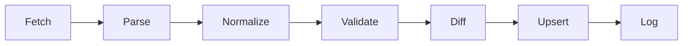
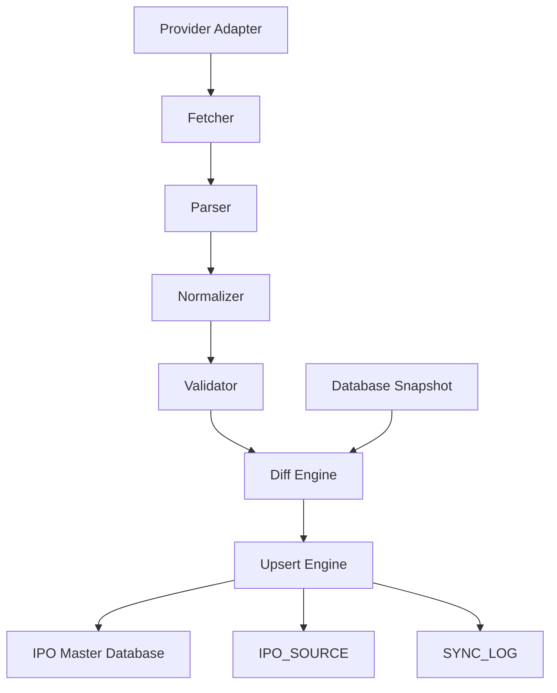

# IPO Data Pipeline

Status: proposal and skeleton for Sprint 5.

This sprint establishes the data pipeline architecture only. It does not connect
to HKEX, Futu, Yaocai, Phillip, Bright Smart, or any other external provider.

## Pipeline

## Purpose

The pipeline converts arbitrary provider data into IPO Master Database records.
All providers must go through the same path:

- HKEX
- Futu
- Yaocai
- Phillip
- Bright Smart
- Future dark pool providers
- Future AI enrichment providers

Pages must not call external providers. Pages only read normalized database
records.

## Stages

## 1. Fetch

Fetcher retrieves provider raw records.

Current sprint rule: no network implementation yet.

Input: none.

Output: `ProviderRawRecord[]`.

## 2. Parse

Parser converts raw payloads into provider-specific structured records.

Input: `ProviderRawRecord[]`.

Output: `ParsedProviderRecord[]`.

## 3. Normalize

Normalizer converts provider-specific fields into the IPO Master Database shape.

Input: `ParsedProviderRecord[]`.

Output: `NormalizedIpoMasterRecord[]`.

Responsibilities:

- Map stock code aliases such as `stockCode`, `ticker`, `code`.
- Map stock name aliases such as `stockName`, `companyName`, `name`.
- Normalize price, lot size, listing dates, margin data, source metadata.
- Generate a payload hash for diffing and provenance.

All providers must call this layer.

## 4. Validate

Validator checks data quality before database writes.

Checks:

- Required fields.
- Stock code format.
- IPO status.
- Date validity.
- Money and numeric values.
- Negative amount detection.

Invalid rows are skipped and counted as failures.

## 5. Diff

Diff Engine compares provider records against the database snapshot.

Operations:

- `insert`: new IPO.
- `update`: existing IPO with changed fields.
- `skip`: same record and same payload hash.
- `delete`: existing database row missing from provider payload.

Important rule: delete means "provider did not include this record". It should
not physically delete IPO history without a later retention policy.

## 6. Upsert

Upsert Engine performs database writes in one transaction.

Responsibilities:

- Insert new master records.
- Update changed records.
- Insert source snapshots.
- Preserve append-only provenance.
- Return counts for added, updated, skipped, deleted, failed.

## 7. Log

Pipeline writes a final result to the sync log.

Logged fields:

- provider
- startedAt
- endedAt
- added
- updated
- skipped
- deleted
- failed
- message

## Architecture

## Contracts

Code skeleton lives in:

- `lib/sync/pipeline/types.ts`
- `lib/sync/pipeline/normalizer.ts`
- `lib/sync/pipeline/validator.ts`
- `lib/sync/pipeline/diffEngine.ts`
- `lib/sync/pipeline/upsertEngine.ts`
- `lib/sync/pipeline/pipeline.ts`

## Provider Rule

A provider can have custom Fetch and Parse logic, but it cannot bypass:

1. Normalizer
2. Validator
3. Diff Engine
4. Upsert Engine
5. Sync Log

This prevents each provider from inventing its own database write behavior.

## Future Implementation Order

1. Replace placeholder store interfaces with Prisma repositories.
2. Add HKEX fetcher without changing pipeline contracts.
3. Add HKEX parser.
4. Run dry-run diff mode.
5. Enable upsert in transaction.
6. Add provider-specific source snapshots.
