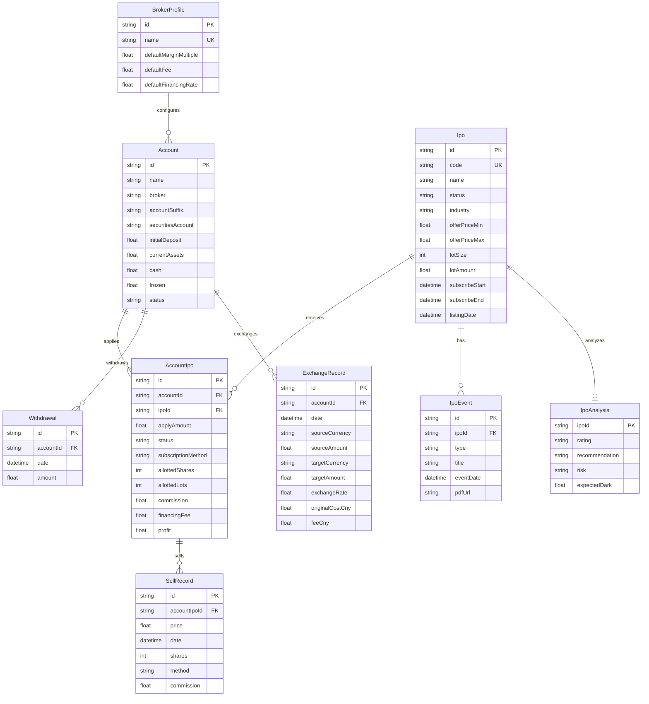

# PostgreSQL ER Diagram

```mermaid
erDiagram
  BrokerProfile ||--o{ Account : configures
  Account ||--o{ AccountIpo : applies
  Ipo ||--o{ AccountIpo : receives
  Ipo ||--o{ IpoEvent : has
  Ipo ||--o| IpoAnalysis : analyzes
  AccountIpo ||--o{ SellRecord : sells
  Account ||--o{ Withdrawal : withdraws
  Account ||--o{ ExchangeRecord : exchanges

  BrokerProfile {
    string id PK
    string name UK
    float defaultMarginMultiple
    float defaultFee
    float defaultFinancingRate
  }

  Account {
    string id PK
    string name
    string broker
    string accountSuffix
    string securitiesAccount
    float initialDeposit
    float currentAssets
    float cash
    float frozen
    string status
  }

  Ipo {
    string id PK
    string code UK
    string name
    string status
    string industry
    float offerPriceMin
    float offerPriceMax
    int lotSize
    float lotAmount
    datetime subscribeStart
    datetime subscribeEnd
    datetime listingDate
  }

  AccountIpo {
    string id PK
    string accountId FK
    string ipoId FK
    float applyAmount
    string status
    string subscriptionMethod
    int allottedShares
    int allottedLots
    float commission
    float financingFee
    float profit
  }

  SellRecord {
    string id PK
    string accountIpoId FK
    float price
    datetime date
    int shares
    string method
    float commission
  }

  ExchangeRecord {
    string id PK
    string accountId FK
    datetime date
    string sourceCurrency
    float sourceAmount
    string targetCurrency
    float targetAmount
    float exchangeRate
    float originalCostCny
    float feeCny
  }

  Withdrawal {
    string id PK
    string accountId FK
    datetime date
    float amount
  }

  IpoEvent {
    string id PK
    string ipoId FK
    string type
    string title
    datetime eventDate
    string pdfUrl
  }

  IpoAnalysis {
    string ipoId PK
    string rating
    string recommendation
    string risk
    float expectedDark
  }
```
