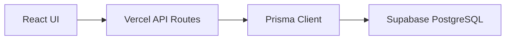

# PostgreSQL Final Migration Report

## Scope

This migration moves the remaining business records from SQLite / recovery JSON into PostgreSQL via Prisma.

Imported data is idempotent:

- No `truncate`
- No `drop table`
- No destructive deletes
- All recovery imports use `upsert`

## Added Tables

| Table | Prisma Model | Purpose |
| --- | --- | --- |
| `sell_record` | `SellRecord` | Partial or full sell records for each account IPO application |
| `exchange_record` | `ExchangeRecord` | Manual FX conversion records tied to accounts |
| `withdrawal` | `Withdrawal` | Account withdrawal records |

## Existing Tables Used

| Table | Source |
| --- | --- |
| `account` | `HKIPO_LATEST_RECOVERY_IMPORT.json.accounts` |
| `ipo` | `HKIPO_LATEST_RECOVERY_IMPORT.json.ipos` |
| `account_ipo` | `subscriptions + allotments` |
| `ipo_event` | `prisma/dev.db` SQLite `ipo_event` table |

## Import Script

Run:

```bash
npx tsx scripts/import-recovery.ts
```

The script imports:

- Broker profiles
- Accounts
- IPOs
- IPO events from SQLite
- Account IPO applications
- Sell records
- Withdrawals
- Exchange records

The script creates missing recovery columns and financial tables with `IF NOT EXISTS` before importing, so it can be rerun safely.

## Expected Recovery Counts

From `HKIPO_LATEST_RECOVERY_IMPORT.json`:

- Accounts: 12
- IPOs: 19
- Subscriptions: 163
- Allotments: 163
- Sell records: 24

From SQLite:

- IPO events: 149

## Verified Import Result

Last verified import command:

```bash
npx tsx scripts/import-recovery.ts
```

Output:

- BrokerProfiles imported: 2
- Accounts imported: 12
- IPOs imported: 19
- SQLite event IPOs imported: 97
- IPO events imported: 149
- Subscriptions imported: 163
- SellRecords imported: 24
- Withdrawals imported: 0
- ExchangeRecords imported: 0

Database counts after import:

- Account: 12
- Ipo: 98
- AccountIpo: 163
- IpoEvent: 149
- SellRecord: 24
- Withdrawal: 0
- ExchangeRecord: 0

Note: SQLite `ipo_event` rows reference SQLite IPO ids. The import script upserts the 97 referenced SQLite IPO rows first, then maps each event to the PostgreSQL IPO id. This preserves foreign keys without deleting or truncating existing recovery data.

## Runtime Data Flow



Business data should be read from PostgreSQL through API routes. Browser `localStorage` remains acceptable only for UI preferences and non-authoritative client settings.

## Remaining Follow-up

The legacy data export page still keeps browser-side backup utilities for manual export and recovery UX. It should not be treated as the source of truth; PostgreSQL is authoritative for account, IPO, application, sell, withdrawal, and exchange records.
